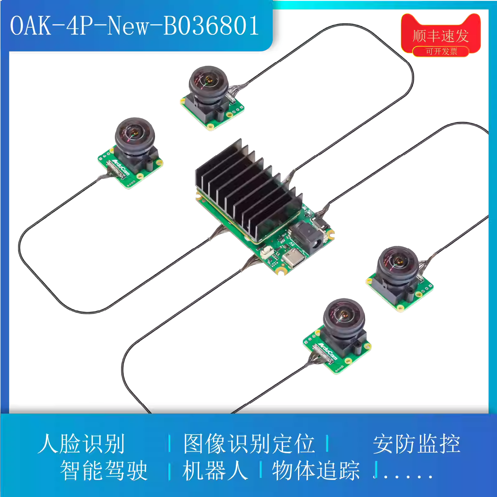
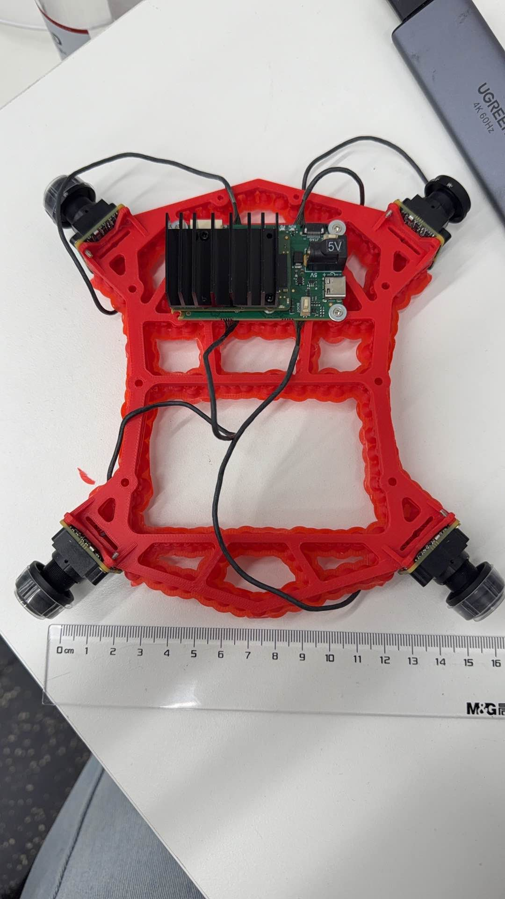

# OAK工装迁移到isaacsim

## 组装相机
### OAK工装介绍
`OAK-4P-New-B036801`结构如图， 



将`OAK-4P-New-B036801`装到工装上如图，


同事使用这个工装进行标定， 得到标定结果， 在`docs/oak_camera/calibration`

### 将omni相机迁移到isaacsim仿真中(部分内参)
[迁移过程](oak_camera/thinking.md)

生成每个相机的enter/out纹理
```
./app/python.sh tools/cameras/oak_generate_lut_textures.py
```

测试简单场景, 会在workdir/render_output中生成可视化采集的图片
```
./app/python.sh tools/cameras/oak_test_lut.py
```

### 将OAK-4P-New-B036801 工装 迁移至 Isaac Sim(外参)
上面已经获得了相机内参， 现在获得相机外参，就可以把整个工装迁移到isaacsim中

```
./app/python.sh tools/cameras/oak_camera_extrinsics.py 
```
执行结果

```
===== CAM_A (直接标定) (Isaac Sim Pose, IMU as world origin) =====
  T_ci (imu→cam):
  [[ 0.70186463  0.71162023  0.03134796  0.05005191]
 [-0.02696485 -0.01743362  0.99948435  0.05051555]
 [ 0.71179979 -0.70234801  0.00695269 -0.15750001]
 [ 0.          0.          0.          1.        ]]
  Translate:   X=0.078341  Y=-0.145357  Z=-0.050963
  Orientation: X=89.4  Y=45.4  Z=2.2

===== CAM_B (由 CAM_A + 双目baseline 推算) (Isaac Sim Pose, IMU as world origin) =====
  T_ci (imu→cam):
  [[ 0.70998113 -0.70415233  0.00981282 -0.26422639]
 [-0.02870201 -0.01501126  0.99947529  0.04813678]
 [-0.70363555 -0.70989025 -0.03086831 -0.16034264]
 [ 0.          0.          0.          1.        ]]
  Translate:   X=0.076155  Y=-0.299159  Z=-0.050468
  Orientation: X=92.5  Y=-44.7  Z=2.3

===== CAM_C (由 A→B→C 推算) (Isaac Sim Pose, IMU as world origin) =====
  T_ci (imu→cam):
  [[-0.70159731 -0.71231358 -0.01925076 -0.2679275 ]
 [-0.02125473 -0.0060841   0.99975558  0.04962166]
 [-0.7122566   0.701835   -0.01087144  0.15582224]
 [ 0.          0.          0.          1.        ]]
  Translate:   X=-0.075937  Y=-0.299908  Z=-0.053073
  Orientation: X=-90.9  Y=-45.4  Z=178.3

===== CAM_D (由 A→B→C→D 推算) (Isaac Sim Pose, IMU as world origin) =====
  T_ci (imu→cam):
  [[-0.70907559  0.70512054 -0.00410507  0.05729041]
 [-0.01305063 -0.00730268  0.99988817  0.05141376]
 [ 0.7050117   0.70904986  0.01438042  0.15358788]
 [ 0.          0.          0.          1.        ]]
  Translate:   X=-0.066987  Y=-0.148923  Z=-0.053381
  Orientation: X=-88.8  Y=44.8  Z=178.9

===== CAM_A (闭环验证: A→B→C→D→A) (Isaac Sim Pose, IMU as world origin) =====
  T_ci (imu→cam):
  [[ 0.70754851  0.70636618  0.02054076  0.03950933]
 [-0.01149855 -0.01755528  0.99977977  0.0478438 ]
 [ 0.70657122 -0.70762888 -0.00429902 -0.1843769 ]
 [ 0.          0.          0.          1.        ]]
  Translate:   X=0.102871  Y=-0.157539  Z=-0.049437
  Orientation: X=90.3  Y=45.0  Z=0.9

============================================================
共面性检查 (各相机在 IMU 坐标系下的位置):
============================================================
  CAM_A: X=0.0783  Y=-0.1454  Z=-0.0510
  CAM_B: X=0.0762  Y=-0.2992  Z=-0.0505
  CAM_C: X=-0.0759  Y=-0.2999  Z=-0.0531
  CAM_D: X=-0.0670  Y=-0.1489  Z=-0.0534
```

获得外参后， 用isaacsim GUI定义一个CameraRig, 保存在`assets/cameras/oak_camera_4lut_origin.usd`

### bake额外参数
前面把相机内参和外参得到了, 为了把相机组所有参数都放进USD文件中, 还需bake一些参数到USD文件中

把`assets/cameras/oak_camera_4lut_origin.usd`复制一个新的文件`assets/cameras/oak_camera_4lut.usd`

一条命令完成：内参 bake、从 LUT EXR 自动估计 `maskRadius`、修正 `verticalAperture`（1920×1200 → 3.6mm）：

```
./app/python.sh tools/cameras/oak_bake_camera_intrinsics.py \
    --usd assets/cameras/oak_camera_4lut.usd \
    --yaml docs/oak_camera/calibration/fisheye_cams.yaml \
    --texture_dir assets/cameras/oak_camera_texture
```

说明：
- 已 bake 过 `generalizedProjectionDirectionTexturePath` 时，可省略 `--texture_dir`，脚本会从 USD 解析 EXR 路径。
- 需要手动覆盖某路半径时再加 `--mask_radius CAM_A=952`（优先于自动估计）。
- 仅改 aperture、不 rebake 内参：`tools/cameras/fix_camera_vertical_aperture.py --usd ...`
- 单独预览半径（可选）：`tools/cameras/oak_compute_mask_radius.py --texture_dir ... --yaml ...`


## 验证相机
### 采集数据
```
./app/python.sh gen_data.py \
--seed 0 \
--scene_usd_url /home/fufa/projects2026/SimDataGen/asset_extern/TaoBao03/108_Bazaar/Demo.usd \
--camera_usd_url /home/fufa/projects2026/SimDataGen/assets/cameras/oak_camera_4lut.usd \
--output_dir /home/fufa/projects2026/SimDataGen/workdir/108_Bazaar_OAK \
--occupancy_resolution 0.25 \
--num_points 60 \
--num_paths 1 \
--max_angle_deviation 4 \
--erode_iterations 2 \
--obstacle_dilate_iterations 1 \
--obstacle_envelope_iterations 10 \
--step_size_xy 0.25 \
--step_size_z 0.25 \
--max_dz_per_step 0.25 \
--min_path_extent 1 \
--min_path_compact_window 10 \
--max_path_generation_attempts 10000
```

### 投影验证
```
./app/python.sh project_cloud.py --data_dir workdir/108_Bazaar_OAK/ --show_num 60
```
### mask验证
```
./app/python.sh tools/check_data/overlay_mask_verify.py --base workdir/108_Bazaar_OAK/
```