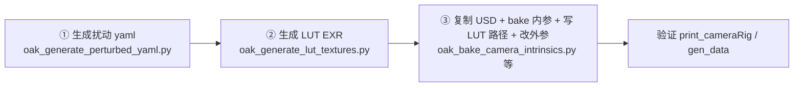

# 4lut + 2 H30YA 相机组 — 内外参扰动（统一流程）

本文档描述 4lut + 2 H30YA 工装上的**内参 / 外参 / 内外参联合扰动**完整流程，用于泛化性测试

基准工装见 [camera_OAK_H30YA.md](camera_OAK_H30YA.md)（`assets/cameras/oak_camera_4lut_2H30YA.usd`）。

---

## 1. 扰动分类

| 类别 | profile / 名称 | 作用 | 改动对象 |
|------|----------------|------|----------|
| **内参 — 小幅漂移** | `small_change` | ±2% 量级标定漂移，评估模型对轻微内参误差的鲁棒性 | 4 路 omni 内参 + LUT EXR + `maskRadius` |
| **内参 — 针孔倾向** | `pinhole_like` | 降低 xi、减弱 radtan，成像更接近针孔 | 同上 |
| **内参 — 鱼眼倾向** | `fisheye_like` | 提高 xi、增强 radtan，成像更接近 omni/鱼眼 | 同上 |
| **外参扰动** | `extrinsics_change` | 评估安装/标定外参偏差 | 6 路相机在 rig 内的 **Translate / Orientation**（USD 位姿） |
| **内外参联合** | 内参 profile + `--perturb-extrinsics` | 同时考察内参漂移与外参偏差 | 内参 yaml + EXR + 扰动后 `T_cam_imu` |

**始终不变（除非做外参扰动）：**

- 4 路鱼眼分辨率 1920×1200
- 2 路 H30YA pinhole（CAM_Front / CAM_Back）分辨率 1920×1200
- 外参扰动时：内参与 LUT 保持原版；仅内参扰动时：外参保持原版

---

## 2. 命名约定

每套扰动资产使用同一 **suffix**，便于对照：

| suffix 示例 | yaml | LUT 目录 | USD |
|-------------|------|----------|-----|
| `perturbed_small_change` | `docs/oak_camera_perturbed/fisheye_cams_small_change.yaml` | `assets/cameras/oak_camera_texture_perturbed_small_change/` | `assets/cameras/oak_camera_4lut_2H30YA_perturbed_small_change.usd` |
| `perturbed_pinhole_like` | `.../fisheye_cams_pinhole_like.yaml` | `.../oak_camera_texture_perturbed_pinhole_like/` | `.../oak_camera_4lut_2H30YA_perturbed_pinhole_like.usd` |
| `perturbed_fisheye_like` | `.../fisheye_cams_fisheye_like.yaml` | `.../oak_camera_texture_perturbed_fisheye_like/` | `.../oak_camera_4lut_2H30YA_perturbed_fisheye_like.usd` |
| `perturbed_extrinsics_change` | `.../fisheye_cams_extrinsics_change.yaml` | 复用 `assets/cameras/oak_camera_texture/` | `.../oak_camera_4lut_2H30YA_perturbed_extrinsics_change.usd` |
| `perturbed_small_change_extrinsics` | 同上 + `--perturb-extrinsics --seed N` | 随内参 profile | 联合 suffix 的 USD |

---

## 3. 统一三步流程



以下以 **`perturbed_small_change`** 为例；其他 profile 仅替换 suffix / `--profile` 即可。

### 步骤 ① — 生成扰动 yaml（内参 ± 可选外参）

工具：`tools/cameras/oak_generate_perturbed_yaml.py`  
基准标定：`docs/oak_camera/calibration/fisheye_cams.yaml`（含 `intrinsics`、`distortion_coeffs`、`T_cam_imu`）。

**仅内参扰动（三选一 profile）：**

```bash
mkdir -p docs/oak_camera_perturbed

# 小幅漂移（原 intrinsics_change）
./app/python.sh tools/cameras/oak_generate_perturbed_yaml.py \
    --profile small_change \
    --output docs/oak_camera_perturbed/fisheye_cams_small_change.yaml

# 针孔倾向
./app/python.sh tools/cameras/oak_generate_perturbed_yaml.py \
    --profile pinhole_like \
    --output docs/oak_camera_perturbed/fisheye_cams_pinhole_like.yaml

# 鱼眼倾向
./app/python.sh tools/cameras/oak_generate_perturbed_yaml.py \
    --profile fisheye_like \
    --output docs/oak_camera_perturbed/fisheye_cams_fisheye_like.yaml
```

脚本在原始 yaml 上逐相机修改 `intrinsics` 与 `distortion_coeffs`；**默认保留 `T_cam_imu` 不变**。

**外参扰动（程序随机、小幅度、可复现）：**

在相机坐标系对 `T_cam_imu` 右乘小随机变换：平移各轴 ±3 mm、旋转各轴 ±1.5°（可通过 `--trans-range-mm` / `--rot-range-deg` 调整）。每路相机用 `seed + 相机名偏移` 独立抽样，同一 `--seed` 可复现。

```bash
# 仅外参（内参保持原版）
./app/python.sh tools/cameras/oak_generate_perturbed_yaml.py \
    --profile extrinsics_change \
    --seed 0 \
    --output docs/oak_camera_perturbed/fisheye_cams_extrinsics_change.yaml
```

**内外参联合：** 在内参 profile 上叠加 `--perturb-extrinsics`（与上式共用同一 `--seed`）：

```bash
./app/python.sh tools/cameras/oak_generate_perturbed_yaml.py \
    --profile small_change \
    --perturb-extrinsics \
    --seed 0 \
    --output docs/oak_camera_perturbed/fisheye_cams_small_change_extrinsics.yaml
```

### 步骤 ② — 生成 LUT EXR

工具：`tools/cameras/oak_generate_lut_textures.py`  
按 yaml 内参为 CAM_A..D 各生成 2 个 EXR：`rayEnterDirection`、`rayExitPosition`。

```bash
./app/python.sh tools/cameras/oak_generate_lut_textures.py \
    --yaml docs/oak_camera_perturbed/fisheye_cams_small_change.yaml \
    --output_dir assets/cameras/oak_camera_texture_perturbed_small_change
```

输出 8 个文件，例如：

- `CAM_A_rayEnterDirection.exr` / `CAM_A_rayExitPosition.exr`
- … CAM_B .. CAM_D 同理

脚本会在生成 rayEnter EXR 后打印建议的 `maskRadius`（圆心为 Kalibr `cx/cy`）。

**外参-only 扰动：** 内参未变，**无需**重新生成 EXR，继续使用 `assets/cameras/oak_camera_texture/`。

---

### 步骤 ③ — 复制 USD 并写入扰动后的内外参

#### 3.1 复制基准 USD

```bash
cp assets/cameras/oak_camera_4lut_2H30YA.usd \
   assets/cameras/oak_camera_4lut_2H30YA_perturbed_small_change.usd
```

内外参联合扰动时，在**已 bake 内参的副本**上再改外参即可（或一步复制后依次执行 3.2 → 3.3）。

#### 3.2 Bake 内参 + 自动 maskRadius

工具：`tools/cameras/oak_bake_camera_intrinsics.py`

写入 4 路鱼眼的 `omni:calibration:*`、从 EXR 自动估计 `maskRadius`（`--mask_center calibration`）、修正 `verticalAperture`，并为 2 路 H30YA 写入分辨率。

```bash
./app/python.sh tools/cameras/oak_bake_camera_intrinsics.py \
    --usd assets/cameras/oak_camera_4lut_2H30YA_perturbed_small_change.usd \
    --yaml docs/oak_camera_perturbed/fisheye_cams_small_change.yaml \
    --texture_dir assets/cameras/oak_camera_texture_perturbed_small_change \
    --mask_center calibration \
    --resolution CAM_Front=1920x1200 \
    --resolution CAM_Back=1920x1200
```

`maskRadius` 由 bake 脚本从 EXR 自动估计（圆心为 Kalibr `cx/cy`，半径为 EXR 可渲染区域在圆心处的外接圆；运行时 `CameraRig` 还会用 rayEnter EXR 生成 bitmap mask，比纯圆形更贴边）。

参考值（取整，供核对）：

| profile | CAM_A | CAM_B | CAM_C | CAM_D |
|---------|-------|-------|-------|-------|
| 原版 / small_change | 952 | 950 | 943 | 949 |
| fisheye_like | 810 | 850 | 813 | 796 |

`pinhole_like` / `fisheye_like` 因 FOV 变化**必须**重新估计；也可单独运行：

```bash
./app/python.sh tools/cameras/oak_compute_mask_radius.py \
    --texture_dir assets/cameras/oak_camera_texture_perturbed_fisheye_like \
    --yaml docs/oak_camera_perturbed/fisheye_cams_fisheye_like.yaml \
    --format bake_args
```

#### 3.3 写入 LUT 纹理路径（相对 USD 目录）

工具：`tools/cameras/oak_set_camera_lut_texture_paths.py`

```bash
./app/python.sh tools/cameras/oak_set_camera_lut_texture_paths.py \
    --usd assets/cameras/oak_camera_4lut_2H30YA_perturbed_small_change.usd \
    --texture_dir assets/cameras/oak_camera_texture_perturbed_small_change
```

#### 3.4 写入外参（bake 到 USD）

工具：`tools/cameras/oak_bake_camera_extrinsics.py`  
从 yaml 读取 4 路鱼眼的 `T_cam_imu`，写入各相机 prim 的 Translate / RotateXYZ。

```bash
./app/python.sh tools/cameras/oak_bake_camera_extrinsics.py \
    --usd assets/cameras/oak_camera_4lut_2H30YA_perturbed_extrinsics_change.usd \
    --yaml docs/oak_camera_perturbed/fisheye_cams_extrinsics_change.yaml \
    --perturb-pinholes \
    --seed 0
```

`--perturb-pinholes`：yaml 不含 CAM_Front / CAM_Back 时，对两路针孔相机在**当前 USD 位姿**上施加与步骤 ① 相同量级、相同 `--seed` 的随机扰动（偏移 `{505,606}`）。

**仅外参扰动：**

```bash
mkdir -p docs/oak_camera_perturbed

./app/python.sh tools/cameras/oak_generate_perturbed_yaml.py \
    --profile extrinsics_change --seed 0 \
    --output docs/oak_camera_perturbed/fisheye_cams_extrinsics_change.yaml

cp assets/cameras/oak_camera_4lut_2H30YA.usd \
   assets/cameras/oak_camera_4lut_2H30YA_perturbed_extrinsics_change.usd

./app/python.sh tools/cameras/oak_bake_camera_extrinsics.py \
    --usd assets/cameras/oak_camera_4lut_2H30YA_perturbed_extrinsics_change.usd \
    --yaml docs/oak_camera_perturbed/fisheye_cams_extrinsics_change.yaml \
    --perturb-pinholes --seed 0
```

内参与 LUT 保持原版，无需步骤 ② 及 3.2 / 3.3。

**内外参联合扰动：** 步骤 ① 使用 `--perturb-extrinsics --seed N`，完成 3.2 / 3.3 后执行上式 bake（`--seed` 与步骤 ① 一致）。

---

## 4. 验证

### 4.1 打印相机参数

```bash
./app/python.sh tools/cameras/print_cameraRig.py \
    --usd assets/cameras/oak_camera_4lut_2H30YA_perturbed_small_change.usd
```

检查：

- `generalizedProjection*TexturePath` 指向本套 EXR 目录（内参扰动时）；
- `omni intrinsics` / `distortion` 与 yaml 一致；
- `Translate` / 外参矩阵：内参-only 应与原版一致；外参扰动应与 yaml 及 bake 日志一致；
- CAM_Front / CAM_Back：内参-only 时与原版完全一致。

### 4.2 采集数据

与 [camera_OAK_H30YA.md](camera_OAK_H30YA.md) 相同，仅替换 `--camera_usd_url`：

```bash
./app/python.sh gen_data.py \
    --seed 0 \
    --scene_usd_url /path/to/scene.usd \
    --camera_usd_url /home/fufa/projects2026/SimDataGen/assets/cameras/oak_camera_4lut_2H30YA_perturbed_small_change.usd \
    --output_dir /home/fufa/projects2026/SimDataGen/workdir/<scene>_perturbed_small_change \
    --occupancy_resolution 0.25 \
    --num_points 60 \
    --num_paths 1 \
    --max_angle_deviation 4 \
    --erode_iterations 2 \
    --obstacle_dilate_iterations 1 \
    --obstacle_envelope_iterations 10 \
    --step_size_xy 0.25 \
    --step_size_z 0.25 \
    --max_dz_per_step 0.25 \
    --min_path_extent 1 \
    --min_path_compact_window 10 \
    --max_path_generation_attempts 10000
```

### 4.3 投影与 mask

```bash
./app/python.sh project_cloud.py --data_dir workdir/<output> --show_num 60

./app/python.sh tools/check_data/overlay_mask_verify.py --base workdir/<output>
```

内参定向扰动（pinhole / fisheye）建议重点看 mask 与可见 FOV 边界是否贴合：

```bash
./app/python.sh tools/check_data/overlay_mask_verify.py \
    --base workdir/<output> \
    --frame 0000_0000
```

期望：`rgb-only` / `depth-only` 接近 0（个位数像素）；`mask-only` 为 mask 略大于可见 FOV 的正常余量。

---

## 5. 工具一览

| 步骤 | 工具 | 说明 |
|------|------|------|
| ① | `oak_generate_perturbed_yaml.py` | 内参 profile；`--perturb-extrinsics --seed N` 写 `T_cam_imu` |
| ② | `oak_generate_lut_textures.py` | `--yaml` / `--output_dir` |
| ③ | `oak_bake_camera_intrinsics.py` | 内参、`maskRadius`、H30YA 分辨率 |
| ③ | `oak_set_camera_lut_texture_paths.py` | LUT 相对路径 |
| ③ | `oak_bake_camera_extrinsics.py` | yaml `T_cam_imu` → USD 位姿；`--perturb-pinholes` 覆盖 Front/Back |
| 辅助 | `oak_extrinsics_perturb.py` | 外参扰动核心逻辑（被上述脚本 import） |
| 辅助 | `oak_compute_mask_radius.py` | 单独查看 mask 半径 |
| 辅助 | `print_cameraRig.py` | 打印内外参与纹理路径 |
| 辅助 | `overlay_mask_verify.py` | mask 与渲染边界 IoU |

可选一键脚本（**当前仅 pinhole_like / fisheye_like**，路径仍为旧名，待与本文档 suffix 对齐）：

```bash
./app/python.sh tools/cameras/oak_setup_intrinsics_change_variant.py --variant pinhole_like
./app/python.sh tools/cameras/oak_setup_intrinsics_change_variant.py --variant fisheye_like
```

---

## 6. 泛化性对比建议

同一 scene、同一 `--seed` 与路径规划参数，只换 `--camera_usd_url`：

| 对比组 | USD 示例 |
|--------|----------|
| 原版工装 | `oak_camera_4lut_2H30YA.usd` |
| 内参小幅漂移 | `..._perturbed_small_change.usd` |
| 针孔倾向 | `..._perturbed_pinhole_like.usd` |
| 鱼眼倾向 | `..._perturbed_fisheye_like.usd` |
| 外参扰动 | `..._perturbed_extrinsics_change.usd` |
| 内外参联合 | `..._perturbed_<内参profile>_extrinsics.usd` |

分别采集后喂给已训练模型，可分离：**标定漂移**、**模型类型失配（针孔 vs 鱼眼）**、**外参安装偏差** 对指标的影响。

---

## 7. 注意事项

- 每套内参对应**独立** EXR 目录 + 独立 USD；LUT 路径由 `oak_set_camera_lut_texture_paths.py` 写入相对路径。
- 仅内参扰动时，外参应与原版一致；仅外参扰动时，内参与 LUT 保持原版。
- 外参与内参扰动均通过 `oak_generate_perturbed_yaml.py` 写入 yaml，再由 `oak_bake_camera_extrinsics.py` 烘焙进 USD；**同一套 `--seed` 保证可复现**。
