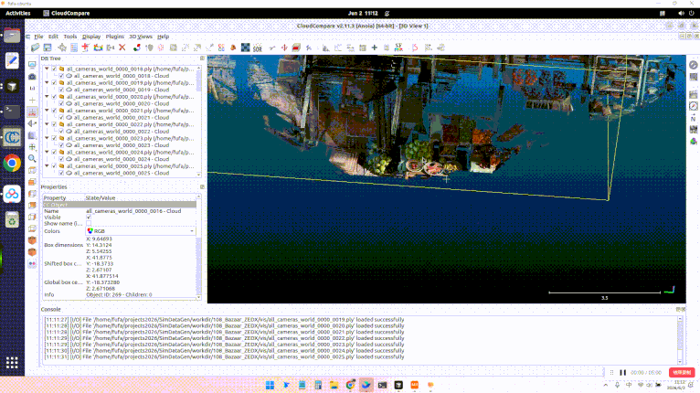

# ZEDX相机
## 组装相机
ZEDX相机是Isaacsim官方支持的相机, 直接把相机从`Isaac Sim>Sensors>Stereolabs>ZED_X>ZED_X.usd`拷贝到`assets/cameras/ZED_X.usdc`即可

## 验证相机
- 先用这个相机在USD场景中采集数据
- 然后将数据投影到点云中, 验证整个流程、相机是否正确

### 采集数据
```
./app/python.sh gen_data.py \
--seed 0 \
--scene_usd_url /home/fufa/projects2026/SimDataGen/asset_extern/TaoBao03/108_Bazaar/Demo.usd \
--camera_usd_url /home/fufa/projects2026/SimDataGen/assets/cameras/ZED_X.usdc \
--output_dir /home/fufa/projects2026/SimDataGen/workdir/108_Bazaar_ZEDX \
--occupancy_resolution 0.25 \
--num_points 60 \
--num_paths 1 \
--max_angle_deviation 4 \
--erode_iterations 2 \
--obstacle_dilate_iterations 1 \
--obstacle_envelope_iterations 10 \
--step_size_xy 0.25 \
--step_size_z 0.25 \
--max_dz_per_step 0.25 \
--min_path_extent 1 \
--min_path_compact_window 10 \
--max_path_generation_attempts 10000
```

### 投影验证
```
./app/python.sh project_cloud.py --data_dir workdir/108_Bazaar_ZEDX/ --show_num 60
./app/python.sh tools/check_data/merge_ply_dedup.py workdir/108_Bazaar_ZEDX/vis/
```

