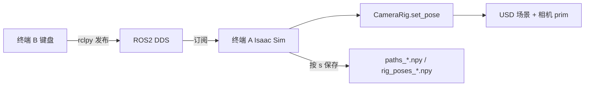

# Demo：键盘遥操 CameraRig 并录制 USD 场景轨迹

本文档说明如何在 Isaac Sim 中加载室内场景与 `CameraRig`，通过 **ROS2 + 键盘** 手动驾驶相机工装，录制 rig 在世界坐标系下的轨迹，供后续 `gen_data.py` 或自定义脚本使用。

---

## 一、目标与组件

| 组件 | 路径 / 说明 |
|------|-------------|
| 场景 USD | `asset_extern/home_000/interior_template.usdc` |
| CameraRig USD | `assets/cameras/oak_camera_4lut.usd` |
| 仿真录制脚本 | `tools/demo_data/record_camera_rig_trajectory.py`（**`./app/python.sh`**） |
| 键盘遥操脚本 | `tools/demo_data/keyboard_camera_rig_teleop.py`（**系统 Python + ROS2**） |
| 核心类 | `sdg_utils/camera.py` 中的 `CameraRig.set_pose()` |

录制的轨迹是 **rig 根节点** `/World/camera_rig` 的位姿序列 `(x, y, z, roll, pitch, yaw)`，与 `gen_data.py` 中 `camera_rig.set_pose(x, y, z, roll, pitch, yaw)` 使用同一套 API。

---

## 二、环境准备

### 1. Isaac Sim（本项目）

```bash
cd /home/fufa/projects2026/SimDataGen
# app -> $HOME/isaac_sim/5.1，见 install.md
ls -l app
```

仿真端 Python 使用：

```bash
./app/python.sh <脚本>
```

**ROS2 Bridge 必须在启动 Isaac Sim 之前配置环境变量**（否则会报 `ROS2 Bridge startup failed` / `No module named 'rclpy'`）。推荐用封装脚本（已自动 `export`）：

```bash
./tools/demo_data/run_record_camera_rig_trajectory.sh ...
```

或手动在运行 `./app/python.sh` **之前**执行（路径按你的 `app` 链接调整）：

```bash
export ROS_DISTRO=humble
export RMW_IMPLEMENTATION=rmw_fastrtps_cpp
export LD_LIBRARY_PATH=$LD_LIBRARY_PATH:/home/fufa/isaac_sim/5.1/exts/isaacsim.ros2.bridge/humble/lib
export ROS_DOMAIN_ID=0
```

启用 `isaacsim.ros2.bridge` 后，Isaac Sim 内置 **Omniverse 版 rclpy**（非系统 `pip install rclpy`），可与主机 ROS2 通过相同 `ROS_DOMAIN_ID` 通信。

### 2. 主机 ROS2（键盘端）

Ubuntu 22.04 建议 **ROS2 Humble**，与 Teleoperation 项目一致：

```bash
source /opt/ros/humble/setup.bash
# 可选：与仿真隔离域，两端 export 相同值即可
export ROS_DOMAIN_ID=0
```

键盘脚本用系统 Python 3.10（与 Humble 一致）：

```bash
python3 --version   # 应为 3.10.x
python3 -c "import rclpy; print('OK')"
```

### 3. 确认资产存在

```bash
test -f asset_extern/home_000/interior_template.usdc && echo scene OK
test -f assets/cameras/oak_camera_4lut_2H30YA.usd && echo camera OK
```

---

## 三、ROS2 话题约定

| 话题 | 类型 | 方向 | 含义 |
|------|------|------|------|
| `/camera_rig/nudge` | `std_msgs/Float64MultiArray` | 键盘 → 仿真 | `[lateral, longitudinal, dyaw]`：左右/前后（米，相对 **CameraRig 自身**）、yaw（度） |
| `/camera_rig/record` | `std_msgs/String` | 键盘 → 仿真 | `"start"` / `"stop"` |
| `/camera_rig/init_pose` | `std_msgs/Float64MultiArray` | 键盘 → 仿真 | 6 元组：`x,y,z,roll,pitch,yaw`（米、度） |
| `/camera_rig/state` | `std_msgs/Float64MultiArray` | 仿真 → 键盘 | 当前 rig 位姿 |

仿真端按 rig 当前位姿取**右轴（局部 -Y）**与**前轴（局部 +X）**，将左右/前后变换到世界 XY；**Z 固定**。任意 yaw 下 `a` 恒为左、`d` 右、`w` 前、`s` 后。`z`/`c` 每次 yaw **10°**。

**默认视口相机为 `CAM_A`**（与采图一致的鱼眼画面）。启动后 Isaac 主视口应显示 `CAM_A`。步进时画面随 rig 上的相机一起移动（脚本**不会**再改写传感器外参，避免黑屏）。

若要用编辑器透视相机俯视 rig：`--viewport-camera perspective`

**双视口（前/后针孔）**：Isaac Sim 支持多个 Viewport 窗口。主视口 + 第二窗口示例：

```bash
./tools/demo_data/run_record_camera_rig_trajectory.sh \
  ... \
  --viewport-camera CAM_Front \
  --viewport-camera-2 CAM_Back
```

会保留默认主 Viewport 绑定 `CAM_Front`，并再弹出一个独立窗口显示 `CAM_Back`（两路画面均随 rig 移动）。也可在 GUI 中 **Window → Viewport → New Viewport Window** 手动添加，再在视口左上角相机菜单里切换到 `CAM_Front` / `CAM_Back`。

### CameraRig 初始位姿参数

**仿真端**（推荐，场景加载时即生效）：

| 参数 | 说明 |
|------|------|
| `--init_pose X Y Z ROLL PITCH YAW` | 一次性指定 6 自由度 |
| `--init-x` / `--init-y` / `--init-z` | 覆盖位置分量（米） |
| `--init-roll` / `--init-pitch` / `--init-yaw` | 覆盖姿态分量（度） |

示例：只改高度与 yaw：

```bash
./app/python.sh tools/demo_data/record_camera_rig_trajectory.py \
  ... \
  --init_pose 1 1 1.5 0 0 0 \
  --init-z 1.8 \
  --init-yaw 90
```

**键盘端**（仿真已启动后，通过 ROS 重置位姿；需指定至少一个 `--init-*` 才会发布）：

```bash
python3 tools/demo_data/keyboard_camera_rig_teleop.py \
  --init-x 2.0 --init-y -1.0 --init-z 1.6
```

---

## 四、操作步骤（两个终端）

### 终端 A：启动 Isaac Sim 录制

```bash
cd /home/fufa/projects2026/SimDataGen

./tools/demo_data/run_record_camera_rig_trajectory.sh \
  --scene_usd /home/fufa/projects2026/SimDataGen/asset_extern/home_000/interior_template.usdc \
  --camera_usd /home/fufa/projects2026/SimDataGen/assets/cameras/oak_camera_4lut_2H110SA.usd \
  --output_dir /home/fufa/projects2026/SimDataGen/workdir/demo_trajectory/home_000_manual \
  --init_pose 1 1 1.5 0 0 0 \
  --viewport-camera CAM_Front \
  --viewport-camera-2 CAM_Back
```

说明：

- 初始位姿见上文「CameraRig 初始位姿参数」；欧拉角为 XYZ 顺序（度），与 `CameraRig.set_pose` 一致。
- 会弹出 Isaac Sim 窗口；场景加载完成后日志提示等待 ROS2 指令。
- 按 `Ctrl+C` 结束仿真（未按 `k` 的录制内容不会自动保存）。

### 终端 B：键盘遥操

```bash
cd /home/fufa/projects2026/SimDataGen
source /opt/ros/humble/setup.bash
export ROS_DOMAIN_ID=0

python3 tools/demo_data/keyboard_camera_rig_teleop.py --step-size 0.1
```

**请先点击终端 B 窗口**。界面固定显示帮助，底部一行刷新 `step` 与 `rig` 坐标。

| 按键 | 功能 |
|------|------|
| `a` / `d` | CameraRig **向左 / 向右**（每按一步） |
| `w` / `s` | CameraRig **向前 / 向后**（每按一步） |
| `z` / `c` | yaw **左 / 右**（每按一次 **10°**） |
| `q` / `e` | 步长 **减小 / 增大** |
| `j` / `k` | **开始**录制 / **停止**并保存 |
| `x` | 退出键盘节点 |

Z 轴始终为启动仿真时 `--init_pose` 里的高度，键盘不能改 Z。

建议流程：`a`/`d`/`w`/`s`/`z`/`c` 在 **rig 自身坐标系**下预览（**不入轨**）→ `j` 开始录制 → 继续步进/转向（终端 A **实时打印**每个轨迹点）→ `k` 保存。

终端 A（仿真）会打印类似：

```
  [000] REC  x=1.000  y=1.000  z=1.500  ...
       Δ=(-0.100, +0.000, 0)  共 3 点
```

未按 `j` 时仅显示 `移动(未录制)`，不会写入轨迹文件。

可选参数：

```bash
python3 tools/demo_data/keyboard_camera_rig_teleop.py \
  --step-size 0.15 --step-step 0.05 --min-step 0.02 --max-step 1.0
```

---

## 五、输出文件

在 `--output_dir` 下每次按 `s` 会生成一组：

| 文件 | 说明 |
|------|------|
| `paths_0000.npy` | 形状 `(1, N, 3)`，仅 XYZ，与 `gen_data.py` 读取的 `paths.npy` 单条路径格式兼容 |
| `rig_poses_0000.npy` | 形状 `(N, 6)`，列为 `x,y,z,roll,pitch,yaw` |
| `trajectory_0000.ply` | 路径可视化（可用 MeshLab / CloudCompare 打开） |
| `trajectory_0000.json` | 元数据（点数、文件名等） |

将某次录制用于自动采数时，可复制为工作目录下的 `trajectory/paths.npy`：

```bash
mkdir -p workdir/my_run/trajectory
cp workdir/demo_trajectory/home_000_manual/paths_0000.npy \
   workdir/my_run/trajectory/paths.npy
```

然后在 `gen_data.py` 中改为读取该路径（若当前流程从 occupancy 自动生成路径，需在脚本或配置里指向手动轨迹）。

---

## 六、架构示意



与 Teleoperation 机械臂方案对比：

| 项目 | 控制量 | 话题示例 |
|------|--------|----------|
| TeleoperationManipulator | 关节角 IK → `JointState` | `/joint_command` |
| 本 Demo | rig 离散步进 | `/camera_rig/nudge` 等 |

---

## 七、常见问题

### 1. `ROS2 Bridge startup failed` / `No module named 'rclpy'`

终端若打印 FastDDS/CycloneDDS 的 `export` 说明，表示 **启动 Isaac Sim 前未设置 ROS2 环境变量**。

```bash
export ROS_DISTRO=humble
export RMW_IMPLEMENTATION=rmw_fastrtps_cpp
export LD_LIBRARY_PATH=$LD_LIBRARY_PATH:/home/fufa/isaac_sim/5.1/exts/isaacsim.ros2.bridge/humble/lib
export ROS_DOMAIN_ID=0
```

推荐改用：

```bash
./tools/demo_data/run_record_camera_rig_trajectory.sh ...
```

### 2. 键盘无反应

- 终端 B 是否 `source /opt/ros/humble/setup.bash` 且 **窗口处于焦点**。
- 两端 `ROS_DOMAIN_ID` 是否一致。
- 终端 A 仿真是否已打印「等待 ROS2 键盘遥操」。
- `ros2 topic list` 是否能看到 `/camera_rig/nudge`。

### 3. 视口全黑或一片黑

- 确认 `--init_pose` 的 XY/Z 在房间内部；可 **View → Frame All**。
- 默认 `CAM_A` 视角下，rig 在墙内/朝墙外也会全黑，用 `a`/`d`/`w`/`s` 移到开阔处。
- 若曾用旧版脚本把画面弄黑，重启 `run_record_camera_rig_trajectory.sh`。

### 4. 看不到 CameraRig / 场景全黑（透视模式）

- 调整 `--init_pose` 的 Z 与 XY，使 rig 位于房间内部。
- 首次加载大场景需等待数秒；可在 Isaac Sim 视口中手动 Fly 到 rig 附近确认。

### 5. 仅 GUI 拖场景、不用本脚本？

也可以像 Teleoperation 那样在 GUI 中打开场景 USD，再单独运行带 ROS 订阅的脚本；本仓库推荐用 `record_camera_rig_trajectory.py` 一次性完成 **加载场景 + 挂载 CameraRig + 订阅 ROS + 写轨迹**，避免漏挂 rig 或 prim 路径不一致。

---

## 八、相关代码索引

- `CameraRig` 位姿设置：`sdg_utils/camera.py` → `set_pose()`
- 轨迹 PLY 工具：`sdg_utils/trajectory.py` → `save_path_ply()`
- 自动路径生成（occupancy）：`sdg_utils/trajectory.py` → `gen_path_3d()`
- 批量采数：`gen_data.py`
- ROS2 订阅示例：Isaac Sim `standalone_examples/api/isaacsim.ros2.bridge/subscriber.py`

---

## 九、快速命令汇总

```bash
# 终端 A
./tools/demo_data/run_record_camera_rig_trajectory.sh \
  --scene_usd asset_extern/home_000/interior_template.usdc \
  --camera_usd assets/cameras/oak_camera_4lut_2H30YA.usd \
  --output_dir workdir/demo_trajectory/home_000_manual \
  --init_pose 0 0 1.5 0 0 0 \
  --viewport-camera CAM_Front \
  --viewport-camera-2 CAM_Back

# 终端 B
source /opt/ros/humble/setup.bash
export ROS_DOMAIN_ID=0
python3 tools/demo_data/keyboard_camera_rig_teleop.py
```

录制：`j` 开始、`k` 保存；移动：`a`/`d` 左右、`w`/`s` 前后；步长：`q`/`e`；退出：`x`；结束仿真：终端 A `Ctrl+C`。
